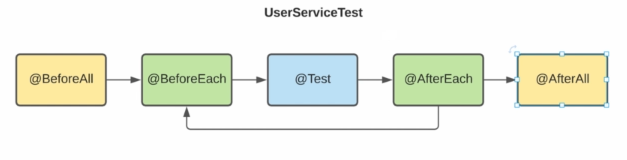
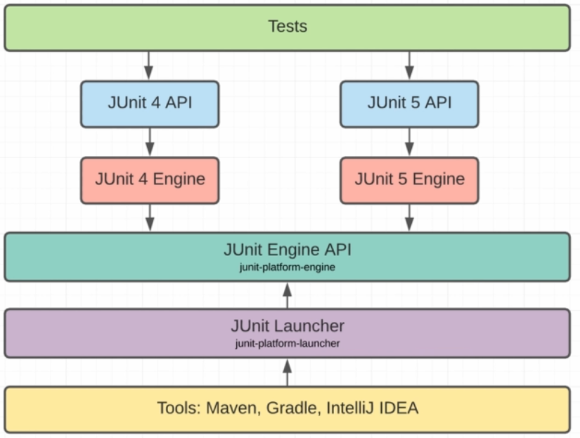
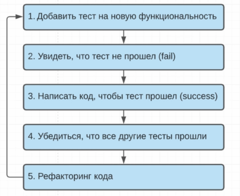
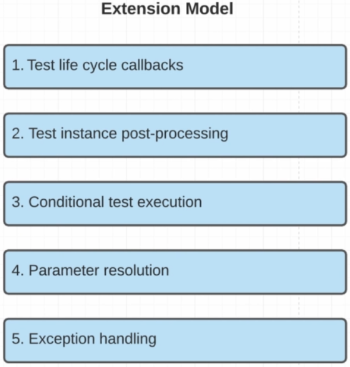
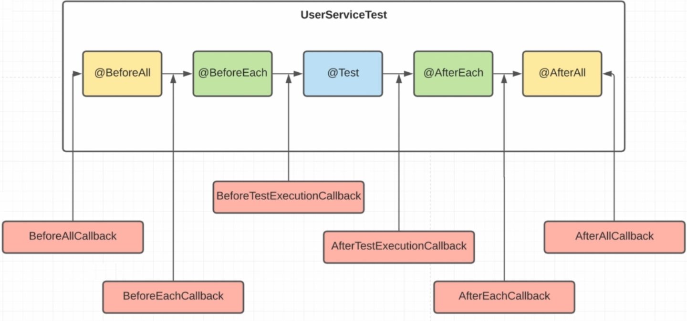
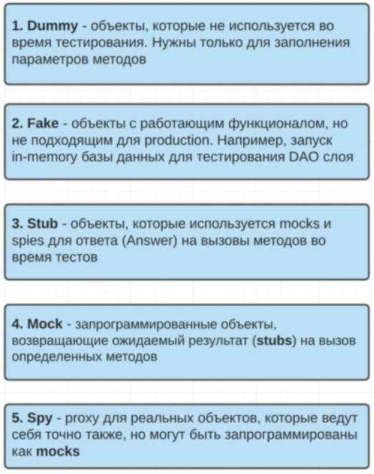

# Тестирование ПО (JUnit5)
Это процесс испытания программы, целью которого является определить соответствие
между ожидаемым поведением с помощью тестов.

Тестирование необходимо не только для проверки нового функционала, но и работоспособности старого 
(регрессионное тестирование)

**Выделяют следующие уровни тестирования:**
1. Unit testing - тестирование маленького компонента приложения (метода). Юнит тест должен правильно отрабатывать в
изоляции от других компонентов.
2. Integration testing - тестирование нескольких компонентов приложения (методов). Несколько юнит тестов работают вместе
как один большой юнит тест.
3. Acceptance testing - тестирование всего приложения в целом, т.е. как оно работает со стороны пользователя 
(функциональное тестирование)

**JUnit5** - один из самых распространенных фреймворков, который предназначен для написания в основном Unit и Integration
тестов.

Для написания Acceptance тестов обычно используется дургие фреймворки, например: JBehave, TestNG.

**JUnit5 разбит на несколько основных под-проектов:**
- JUnit Platform - чтобы была возможность запускать тесты на JVM
- JUnit Jupiter - предоставляет набор классов для написания тестов
- JUnit Vintage - для интерграции с предыдущими версиями JUnit

## Установка зависимостей
```xml

<dependencies>
    <dependency>
        <groupId>org.junit.jupiter</groupId>
        <artifactId>junit-jupiter-engine</artifactId>
        <version>5.8.0-M1</version>
        <scope>test</scope>
    </dependency>

    <dependency>
        <groupId>org.projectlombok</groupId>
        <artifactId>lombok</artifactId>
        <version>1.18.32</version>
    </dependency>
</dependencies>

<build>
<plugins>
    <plugin>
        <groupId>org.apache.maven.plugins</groupId>
        <artifactId>maven-compiler-plugin</artifactId>
        <version>3.8.1</version>
        <configuration>
            <source>15</source>
            <target>15</target>
        </configuration>
    </plugin>
    <plugin>
        <groupId>org.apache.maven.plugins</groupId>
        <artifactId>maven-surefire-plugin</artifactId>
        <version>2.22.2</version>
    </plugin>
</plugins>
</build>

```

## TestAssertions
**Assertions** - класс предоставляет методы для проверки ожидаемых и актуальных значений

### Напишем первый тест
**Созададим класс, чьи методы будем тестировать:**

```java
package com.angubaidullin.testing.dto;

import lombok.Value;

@Value(staticConstructor = "of")
public class User {
    Integer id;
    String username;
    String password;
}
```

```java

package com.angubaidullin.testing.service;

import com.angubaidullin.testing.dto.User;

import java.util.ArrayList;
import java.util.List;

public class UserService {

    private List<User> users = new ArrayList<User>();

    public List<User> getAll() {

        return users;
    }

    public boolean add(User user) {
        return users.add(user);
    }
}

```

**Напишем тест для класса:**

```java

package com.angubaidullin.testing.service;

import com.angubaidullin.testing.dto.User;
import org.junit.jupiter.api.Test;

import java.util.List;

import static org.junit.jupiter.api.Assertions.*;
/*
Плагин мавена будет автоматически считывать классы с суффиксом тест и выполнять 
их в жизненном цикле, например, перед сборкой проекта
 */
class UserServiceTest {
    /*
      Будет сканироваться все методы в тестовом классе, помеченные
      аннотацией @Test      
     */
    @Test
    void usersEmptyIfNoUserAdded() {
        UserService userService = new UserService();
        List<User> users = userService.getAll();
        
        assertTrue(users.isEmpty(), () -> "user list should be empty");
        assertFalse(!users.isEmpty());
        assertEquals(0, users.size(), () -> "user list should be empty");
        //Если в тесте у нас несколько ассертов, то их стоит объеденить в один следующим образом
        assertAll("Testing multiple assertions",
                ()-> assertTrue(users.isEmpty(), ()->"user list should be empty"),
                ()-> assertFalse(users.isEmpty(), ()->"user list should not be empty"),
                ()-> assertEquals(0, users.size(), () -> "user list should be empty"));
    }
}


```

## Test Lifecycle



**Напишем еще тест:**
1. `@TestInstance(TestInstance.Lifecycle.PER_METHOD)`
```java
//Аннотация (по умолчанию), говорит о том, что для каждого теста будет создаваться отдельный экземпляр
@TestInstance(TestInstance.Lifecycle.PER_METHOD)
class UserServiceTest {

    private UserService userService;

    /*
      Метод помеченный @BeforeAll выполняется один раз перед вызовом всех методов 
      в тестовом классе. Поэтому при @TestInstance(TestInstance.Lifecycle.PER_METHOD)
      этот метод должен быть статическим так же, как и метод почеменыный
      аннотацией @AfterAll
     */
    @BeforeAll
    static void init() {
        System.out.println("Before All");
    }

    /*
     Метод помеченный @BeforeEach будет срабатывать перед каждым тестовым методом       
     */
    @BeforeEach
    void prepare() {
        System.out.println("Before each test: " + this);
        userService = new UserService();
    }

    @Test
    void usersEmptyIfNoUserAdded() {
        System.out.println("usersEmptyIfNoUserAdded test: "+ this);
        List<User> users = userService.getAll();
        assertAll("Testing multiple assertions",
                () -> assertTrue(users.isEmpty(), () -> "user list should be empty"),
                () -> assertFalse(!users.isEmpty(), () -> "user list should be empty"),
                () -> assertEquals(0, users.size(), () -> "user list should be empty"));
    }

    @Test
    void usersSizeIfUserAdded() {
        System.out.println("usersSizeIfUserAdded test: "+ this);
        userService.add(User.of(1, "Ivan", "123"));
        userService.add(User.of(2, "Petr", "456"));

        List<User> users = userService.getAll();

        assertEquals(users.size(), 2, () -> "user list should have 2 elements");
    }

    /*
     Метод помеченный @AfterEach будет срабатывать псле каждого тестового метода       
     */
    @AfterEach
    void deleteDataFromDatabase() {
        System.out.println("After each test: " + this);
    }

    /*
      Сработает один раз после выполнения всех тестовых методов 
      в данном тестовом классе.      
     */
    @AfterAll
    static void cleanUp() {
        System.out.println("After All");
    }
}
```

2. `@TestInstance(TestInstance.Lifecycle.PER_CLASS)` - для всех тестов в классе будет создаваться единственный экземпляр
тестового класса. Это позволяет делать методы, помеченные аннотацией `@BeforeAll` и `@AfterAll` нестатическими.

## Launcher API


```xml

        <dependency>
            <groupId>org.junit.platform</groupId>
            <artifactId>junit-platform-launcher</artifactId>
            <version>1.8.0-M1</version>
            <scope>test</scope>
        </dependency>

```
**Напишем класс, через который сможем запускать все тесты проекта:**
```java

package com.angubaidullin.testing;

import org.junit.platform.engine.discovery.DiscoverySelectors;
import org.junit.platform.launcher.Launcher;
import org.junit.platform.launcher.LauncherDiscoveryRequest;
import org.junit.platform.launcher.core.LauncherDiscoveryRequestBuilder;
import org.junit.platform.launcher.core.LauncherFactory;
import org.junit.platform.launcher.listeners.SummaryGeneratingListener;

import java.io.PrintWriter;

public class TestLauncher {
    public static void main(String[] args) {
        Launcher launcher = LauncherFactory.create();

        LauncherDiscoveryRequest request = LauncherDiscoveryRequestBuilder
                .request()
                .selectors(DiscoverySelectors.selectPackage("com.angubaidullin.testing"))
                .build();

        SummaryGeneratingListener summaryGeneratingListener = new SummaryGeneratingListener();

        launcher.execute(request, summaryGeneratingListener);

        try (PrintWriter printWriter = new PrintWriter(System.out)) {
            summaryGeneratingListener.getSummary().printTo(printWriter);
        }

    }
}

```

## TDD (Test Driven Development)


## AssertJ
Дополнительные бибилиотеки для расширения функционала тестирования.

### AssertJ
```xml
    <dependency>
        <groupId>org.assertj</groupId>
        <artifactId>assertj-core</artifactId>
        <version>3.19.0</version>
        <scope>test</scope>
    </dependency>
```
**Добавим функционал в UserService:**
```java
package com.angubaidullin.testing.service;

import com.angubaidullin.testing.dto.User;

import java.util.ArrayList;
import java.util.Arrays;
import java.util.List;
import java.util.Map;
import java.util.stream.Collectors;

public class UserService {

    private List<User> userList = new ArrayList<User>();

    public List<User> getAll() {

        return userList;
    }

    public boolean add(User user) {
        return userList.add(user);
    }

    public void addAll(User... users) {
        userList.addAll(Arrays.asList(users));
    }

    public Map<Integer, User> getAllConvertedById() {
       return userList.stream()
                .collect(Collectors.toMap(User::getId, user -> user));
    }
}
```

**Напишем тесты с помощью AssertJ:**
```java
//Используем библиотеку AssertJ
    @Test
    void usersSizeIfUserAdded_2() {

        System.out.println("usersSizeIfUserAdded test: " + this);
        userService.add(User.of(1, "Ivan", "123"));
        userService.add(User.of(2, "Petr", "456"));

        List<User> users = userService.getAll();

        //Проверка размера коллекции с помощью библиотеки AssertJ
        assertThat(users).hasSize(2);

    }

    @Test
    void usersConvertedToMapByID() {
        userService.add(IVAN);
        userService.add(PETR);

        Map<Integer, User> users = userService.getAllConvertedById();

        assertAll(
                () -> assertThat(users).containsKeys(IVAN.getId(), PETR.getId()),
                () -> assertThat(users).containsValues(IVAN, PETR)
        );

    }
```

## Testing exceptions
**Добавим новый метод в UserService:**
```java
    public Optional<User> login (String username, String password) {
        if (username == null || password == null) {
            throw new IllegalArgumentException("Username and password are required");
        }
        return userList.stream()
                .filter(user -> user.getUsername().equals(username) && user.getPassword().equals(password))
                .findFirst();
    }
```

**Напишем тест на проверку, выбросит ли метод нужное исключение, когда на вход приходят невалидные параметры:**
```java
@Test
void throwExceptionIfUsernameOrPasswordIsNull() {
    assertAll(
            ()->assertThrows(IllegalArgumentException.class, () -> userService.login(null, "pass")),
            ()->assertThrows(IllegalArgumentException.class, () -> userService.login("user", null))
    );
}
```

## Tagging and Filtering
**Напишем еще несколько тестов для метода `login()` класса UserService и пометим их аннотацией `@Tag()`:**
```java
    @Test
    @Tag("login")
    void throwExceptionIfUsernameOrPasswordIsNull() {
        assertAll(
                ()->assertThrows(IllegalArgumentException.class, () -> userService.login(null, "pass")),
                ()->assertThrows(IllegalArgumentException.class, () -> userService.login("user", null))
        );
    }

    @Test
    @Tag("login")
    void loginSuccessIfUserExists() {
        userService.add(IVAN);
        Optional<User> user = userService.login(IVAN.getUsername(), IVAN.getPassword());
        assertThat(user).isPresent();
        user.ifPresent(u -> assertThat(u).isEqualTo(IVAN));
    }

    @Test
    @Tag("login")
    void loginFailIfUserDoesNotExist() {
        userService.add(PETR);
        Optional<User> user = userService.login("user", IVAN.getPassword());
        assertTrue(user.isEmpty());
    }
```
Это дает возможность запускать только тесты, помеченные определенным тегом.

```java
package com.angubaidullin.testing;

import org.junit.platform.engine.discovery.DiscoverySelectors;
import org.junit.platform.launcher.Launcher;
import org.junit.platform.launcher.LauncherDiscoveryRequest;
import org.junit.platform.launcher.TagFilter;
import org.junit.platform.launcher.core.LauncherDiscoveryRequestBuilder;
import org.junit.platform.launcher.core.LauncherFactory;
import org.junit.platform.launcher.listeners.SummaryGeneratingListener;

import java.io.PrintWriter;

public class TestLauncher {
    public static void main(String[] args) {
        Launcher launcher = LauncherFactory.create();

        LauncherDiscoveryRequest request = LauncherDiscoveryRequestBuilder
                .request()
                .selectors(DiscoverySelectors.selectPackage("com.angubaidullin.testing"))
                .filters(
                        TagFilter.includeTags("login")
                )
                .build();

        SummaryGeneratingListener summaryGeneratingListener = new SummaryGeneratingListener();

        launcher.execute(request, summaryGeneratingListener);

        try (PrintWriter printWriter = new PrintWriter(System.out)) {
            summaryGeneratingListener.getSummary().printTo(printWriter);
        }

    }
}

```
**Или с помощью терминала:**
`mvn clean test -Dgroups=login`

**Если мы хотим запустить все тесты, кроме тех, которые помечены определенным тегом:**
```java
package com.angubaidullin.testing;

import org.junit.platform.engine.discovery.DiscoverySelectors;
import org.junit.platform.launcher.Launcher;
import org.junit.platform.launcher.LauncherDiscoveryRequest;
import org.junit.platform.launcher.TagFilter;
import org.junit.platform.launcher.core.LauncherDiscoveryRequestBuilder;
import org.junit.platform.launcher.core.LauncherFactory;
import org.junit.platform.launcher.listeners.SummaryGeneratingListener;

import java.io.PrintWriter;

public class TestLauncher {
    public static void main(String[] args) {
        Launcher launcher = LauncherFactory.create();

        LauncherDiscoveryRequest request = LauncherDiscoveryRequestBuilder
                .request()
                .selectors(DiscoverySelectors.selectPackage("com.angubaidullin.testing"))
                .filters(
                        TagFilter.excludeTags("login")
                )
                .build();

        SummaryGeneratingListener summaryGeneratingListener = new SummaryGeneratingListener();

        launcher.execute(request, summaryGeneratingListener);

        try (PrintWriter printWriter = new PrintWriter(System.out)) {
            summaryGeneratingListener.getSummary().printTo(printWriter);
        }

    }
}
```
**В териминале:** 
`mvn clean test -Dexcudedgroups=login`

**@Tag() можно также ставить над классом**

## Test order Nested tests
**По умолчанию порядок запуска тестов не определен.** Более того, успешный исход работы теста не должен зависеть от
порядка его запуска. Тем неменее в JUnit5 есть возможность установить порядок запуска тестов. Это можно реализовать с 
помощью аннотации `@TestMethodOrder()`.
```java
@TestInstance(TestInstance.Lifecycle.PER_CLASS)
@TestMethodOrder(MethodOrderer.OrderAnnotation.class)
class UserServiceTest {...}
```
Далее с помощью аннотации `@Order()`, который ставится над методами мы можем определить порядок их выполенения:
```java
    @Test
    @Order(1)
    void usersEmptyIfNoUserAdded() {
        System.out.println("usersEmptyIfNoUserAdded test: " + this);
        List<User> users = userService.getAll();
        assertAll("Testing multiple assertions",
                () -> assertTrue(users.isEmpty(), () -> "user list should be empty"),
                () -> assertFalse(!users.isEmpty(), () -> "user list should be empty"),
                () -> assertEquals(0, users.size(), () -> "user list should be empty"));
    }

    @Test
    @Order(2)
    void usersSizeIfUserAdded() {
        System.out.println("usersSizeIfUserAdded test: " + this);
        userService.add(User.of(1, "Ivan", "123"));
        userService.add(User.of(2, "Petr", "456"));

        List<User> users = userService.getAll();

        assertEquals(users.size(), 2, () -> "user list should have 2 elements");
    }
```
Также есть и другие способы упорядочивания вызова тестов:
- `MethodOrderer.MethodName.class` - по именам методов в алфавитном порядке
- `MethodOrderer.Random.class` - рандом
- `MethodOrderer.DisplayName.class` - с помощью аннотации `@DisplayName` на методами можно задать другие имена. 
Тесты отработают в порядке этих имен в алфавитном порядке.


Также можно использовать внутренние классы для того, чтобы улучшить читабельность. Например, у нас есть 3 теста,
связанных с методом `login()`. Их можно вынести во внутренний класс.
```java
    @Nested
    @DisplayName("login method tests")
    @Tag("login")
    class LoginTest {
        @Test
        void throwExceptionIfUsernameOrPasswordIsNull() {
            assertAll(
                    ()->assertThrows(IllegalArgumentException.class, () -> userService.login(null, "pass")),
                    ()->assertThrows(IllegalArgumentException.class, () -> userService.login("user", null))
            );
        }

        @Test
        void loginSuccessIfUserExists() {
            userService.add(IVAN);
            Optional<User> user = userService.login(IVAN.getUsername(), IVAN.getPassword());
            assertThat(user).isPresent();
            user.ifPresent(u -> assertThat(u).isEqualTo(IVAN));
        }

        @Test
        void loginFailIfUserDoesNotExist() {
            userService.add(PETR);
            Optional<User> user = userService.login("user", IVAN.getPassword());
            assertTrue(user.isEmpty());
        }
    }
```

## Dependency injection in JUnit5
**Сначала нужно определить ParameterResolver для класса, чью объекты мы хотим внедрять:**
```java
package com.angubaidullin.testing.paramresolver;

import com.angubaidullin.testing.service.UserService;
import org.junit.jupiter.api.extension.ExtensionContext;
import org.junit.jupiter.api.extension.ParameterContext;
import org.junit.jupiter.api.extension.ParameterResolutionException;
import org.junit.jupiter.api.extension.ParameterResolver;

public class UserServiceParamResolver implements ParameterResolver {
    @Override
    public boolean supportsParameter(ParameterContext parameterContext, ExtensionContext extensionContext) throws ParameterResolutionException {
        return parameterContext.getParameter().getType() == UserService.class;
    }

    @Override
    public Object resolveParameter(ParameterContext parameterContext, ExtensionContext extensionContext) throws ParameterResolutionException {
        ExtensionContext.Store store = extensionContext.getStore(ExtensionContext.Namespace.create(UserService.class));

        return store.getOrComputeIfAbsent(UserService.class, it -> new UserService());
    }
}
```

**Далее можно получить нужную зависимость через конструктор или метод, помеченный аннотацией @BeforeEach:**
```java
@TestInstance(TestInstance.Lifecycle.PER_CLASS)
@TestMethodOrder(MethodOrderer.DisplayName.class)
//Для возможно использования DI также нужно пометить класс аннотацией @ExtendsWith и передать в парметры аннотации резолвер
@ExtendWith({
        UserServiceParamResolver.class
})
class UserServiceTest {

    private UserService userService;
    private static final User IVAN = User.of(1, "Ivan", "123");
    private static final User PETR = User.of(2, "Petr", "456");


    @BeforeAll
    void init() {
        System.out.println("Before All");
    }

    @BeforeEach
    void prepare(UserService userService) {
        System.out.println("Before each test: " + this);
        this.userService = userService;
    }
    //Другие тесты
}    
```

## Parametrized Tests
**В JUnit5 появилась возможность использовать параметризованные тесты.**

Первым делом подключим новую зависимость:
```xml
        <dependency>
            <groupId>org.junit.jupiter</groupId>
            <artifactId>junit-jupiter-params</artifactId>
            <version>5.8.2</version>
            <scope>test</scope>
        </dependency>
```

Напрмер, мы хотим протестировать наш метод `login()` большинством тест кейсов (когда мы вводим существующего юзера,
когда вводим юзера, которого нет, когда вводим невалидные данные и т.д.). Одним тестом мы можем закрыть большинство тест
кейсов.
```java
        @ParameterizedTest(name = "{arguments} test")
        @MethodSource("com.angubaidullin.testing.service.UserServiceTest#getArgsForLoginMethod")
        void loginParamTest(String username, String password, Optional<User> user) {
            userService.addAll(IVAN, PETR);

            Optional<User> maybeUser = userService.login(username, password);
            assertThat(maybeUser).isEqualTo(user);
        }

        public static Stream<Arguments> getArgsForLoginMethod() {
            return Stream.of(
                    Arguments.of("Ivan", "123", Optional.of(IVAN)),
                    Arguments.of("Petr", "456", Optional.of(PETR)),
                    Arguments.of("Petr", "djhs", Optional.empty()),
                    Arguments.of("gjf", "123", Optional.empty())
            );
        }
```
## Flaky tests Timeouts
### Flaky test
**Flaky test** - нестабильный тест. Когда мы запускаем тест, он может то проходить, то падать в рандомных местах.
Это случается из-за неправильной реализации тестов, например, тест зависит от порядка его запуска. Также это бывает
с интеграционными тестами. Если в коде есть такие тесты, которые нужно подправить, но заниматься этим мы не хотим, то 
то можно пометить такой тест аннотацией и оставить в его параметрах комментарий `@Disabled("flaky, need to see and fix")`.
Аннотация `@RepeatedTest(value=5, name=RepeatedTest.LONG_DISPLAY_NAME)`, позволяет запустить один тест несколько раз. 
Полезно, когда мы подправили flaky test и хотим проверить, как будет работать при множественном запуске.

### Timeouts
Таймауты позволяют установить время в течение которого, он должен отработать.
```java
        @Test
        void loginMethodFunctionalityPerformance() {
            Optional<User> ivan = assertTimeout(Duration.ofMillis(200L), () -> {
            //Thread.sleep(300);
                return userService.login("Ivan", "123");
            });
        }
```

```java
        @Test
        @Timeout(value = 200, unit = TimeUnit.MILLISECONDS)
        void loginMethodFunctionalityPerformance2() throws InterruptedException {
            userService.add(IVAN);
            Optional<User> user = userService.login(IVAN.getUsername(), IVAN.getPassword());
            //Thread.sleep(300);
            assertThat(user).isPresent();
            user.ifPresent(u -> assertThat(u).isEqualTo(IVAN));
        }
```

**Таймауты лучшего всего подходят для интеграционных тестов**

## Extension Model


---



---

#### TestLifecycle callbacks
**Будет срабатывать перед методами, помеченными аннотациями `@BeforeAll` & `@AfterAll`
```java
package com.angubaidullin.testing.extetion.beforeafterallextention;

import org.junit.jupiter.api.extension.AfterAllCallback;
import org.junit.jupiter.api.extension.BeforeAllCallback;
import org.junit.jupiter.api.extension.ExtensionContext;

public class GlobalExtension implements BeforeAllCallback, AfterAllCallback {
    @Override
    public void beforeAll(ExtensionContext extensionContext) throws Exception {
        System.out.println("Before All callback");
    }

    @Override
    public void afterAll(ExtensionContext extensionContext) throws Exception {
        System.out.println("After All callback");
    }
}
```
#### Test Instance post-processing
**Сработает после создания объекта класса с тестовыми методами:**
```java
package com.angubaidullin.testing.postprocessing;

import org.junit.jupiter.api.Test;
import org.junit.jupiter.api.extension.ExtensionContext;
import org.junit.jupiter.api.extension.TestInstancePostProcessor;

import java.lang.reflect.Field;

public class PostProcessingExtension implements TestInstancePostProcessor {
    @Override
    public void postProcessTestInstance(Object o, ExtensionContext extensionContext) throws Exception {
        System.out.println("Post processing test instance");
        Field[] declaredFields = o.getClass().getDeclaredFields();
        for (Field field: declaredFields) {
            if (field.isAnnotationPresent(Test.class)) {

            }
        }
    }
}
```

#### Conditional test extension
**extension для проверки условий**
```java
package com.angubaidullin.testing.extetion.conditional;

import org.junit.jupiter.api.extension.ConditionEvaluationResult;
import org.junit.jupiter.api.extension.ExecutionCondition;
import org.junit.jupiter.api.extension.ExtensionContext;

public class ConditionalExtension implements ExecutionCondition {
    @Override
    public ConditionEvaluationResult evaluateExecutionCondition(ExtensionContext extensionContext) {
        return System.getProperty("skip") !=null
                ? ConditionEvaluationResult.disabled("test is skipped"):
                ConditionEvaluationResult.enabled("test is enabled");
    }
}
```

#### Exception handling
**Для обработки исключений**
```java
package com.angubaidullin.testing.extetion.exceptionhandling;

import org.junit.jupiter.api.extension.ExtensionContext;
import org.junit.jupiter.api.extension.TestExecutionExceptionHandler;

import java.io.IOException;

public class ThrowableExtension implements TestExecutionExceptionHandler {
    @Override
    public void handleTestExecutionException(ExtensionContext extensionContext, Throwable throwable) throws Throwable {
        if (throwable instanceof IOException) {
            throw throwable;
        }
    }
}
```

**Подключение к тестовому классу** происходит с помощью аннотации `ExtendWith()`
```java
@TestInstance(TestInstance.Lifecycle.PER_CLASS)
@TestMethodOrder(MethodOrderer.DisplayName.class)
@ExtendWith({
        UserServiceParamResolver.class,
        GlobalExtension.class,
        PostProcessingExtension.class,
        ConditionalExtension.class,
        ThrowableExtension.class
})
class UserServiceTest {
    //Логика тестов
}
```

---

## Mockito
**Mockito Test Doubles**


**Подключим зависимость Mockito**
```xml
        <dependency>
            <groupId>org.mockito</groupId>
            <artifactId>mockito-core</artifactId>
            <version>3.9.0</version>
            <scope>test</scope>
        </dependency>
```

### Mock
```java
package com.angubaidullin.testing.dao;

import java.sql.Connection;
import java.sql.DriverManager;
import java.sql.SQLException;

public class UserDao {

    public boolean delete(Integer id) {
        try (Connection connection = DriverManager.getConnection("url", "username", "pass")) {
            return true;
        } catch (SQLException e) {
            throw new RuntimeException(e);
        }
    }
}
```


```java
package com.angubaidullin.testing.service;

import com.angubaidullin.testing.dao.UserDao;
import com.angubaidullin.testing.dto.User;

import java.util.*;
import java.util.stream.Collectors;

public class UserService {

    private UserDao userDao;
    private List<User> userList = new ArrayList<User>();

    public UserService(UserDao userDao) {
        this.userDao = userDao;
    }
    public UserService() {

    }

    //Какая-то логика

    public boolean deleteUserById(Integer id) {
        return userDao.delete(id);
    }
}

```

```java
package com.angubaidullin.testing.service;

import com.angubaidullin.testing.dao.UserDao;
import com.angubaidullin.testing.dto.User;
import com.angubaidullin.testing.extetion.conditional.ConditionalExtension;
import com.angubaidullin.testing.extetion.exceptionhandling.ThrowableExtension;
import com.angubaidullin.testing.extetion.beforeafterallextention.GlobalExtension;
import com.angubaidullin.testing.extetion.paramresolver.UserServiceParamResolver;
import com.angubaidullin.testing.postprocessing.PostProcessingExtension;
import org.junit.jupiter.api.*;
import org.junit.jupiter.api.extension.ExtendWith;
import org.junit.jupiter.params.ParameterizedTest;
import org.junit.jupiter.params.provider.Arguments;
import org.junit.jupiter.params.provider.MethodSource;
import org.mockito.Mockito;

import java.io.IOException;
import java.time.Duration;
import java.util.List;
import java.util.Map;
import java.util.Optional;
import java.util.concurrent.TimeUnit;import java.util.stream.Stream;

import static org.assertj.core.api.Assertions.assertThat;
import static org.junit.jupiter.api.Assertions.*;

@TestInstance(TestInstance.Lifecycle.PER_CLASS)
@TestMethodOrder(MethodOrderer.DisplayName.class)
@ExtendWith({
        UserServiceParamResolver.class,
        GlobalExtension.class,
        PostProcessingExtension.class,
        ConditionalExtension.class,
})
class UserServiceTest {

    private UserDao userDao;
    private UserService userService;
    private static final User IVAN = User.of(1, "Ivan", "123");
    private static final User PETR = User.of(2, "Petr", "456");
    //Какая-то логика
    @BeforeEach
    void prepare() {
        System.out.println("Before each test: " + this);
        this.userDao = Mockito.mock(UserDao.class);
        this.userService = new UserService(this.userDao);
    }
    //Какая-то логика
    @Test
    void shouldDeleteExisted() {
        userService.add(IVAN);
        
//        Mockito.doReturn(true).when(userDao).delete(IVAN.getId());
//        Mockito.doReturn(true).when(userDao).delete(Mockito.anyInt());
        Mockito.when(userDao.delete(IVAN.getId())).thenReturn(true);
        
        boolean result = userService.deleteUserById(IVAN.getId());
        assertThat(result).isTrue();
    }
}
```

# Mockito Spy
```java
    @BeforeEach
    void prepare() {
        System.out.println("Before each test: " + this);
        this.userDao = Mockito.spy(new UserDao());
        this.userService = new UserService(this.userDao);
    }
```

```java
    @Test
    void shouldDeleteExisted() {
        userService.add(IVAN);
        Mockito.doReturn(true).when(userDao).delete(Mockito.anyInt());
        boolean result = userService.deleteUserById(IVAN.getId());
        assertThat(result).isTrue();
    }
```

```java
Mockito.verify(userDao, Mockito.times(3).delete(IVAN.getId()));
```

